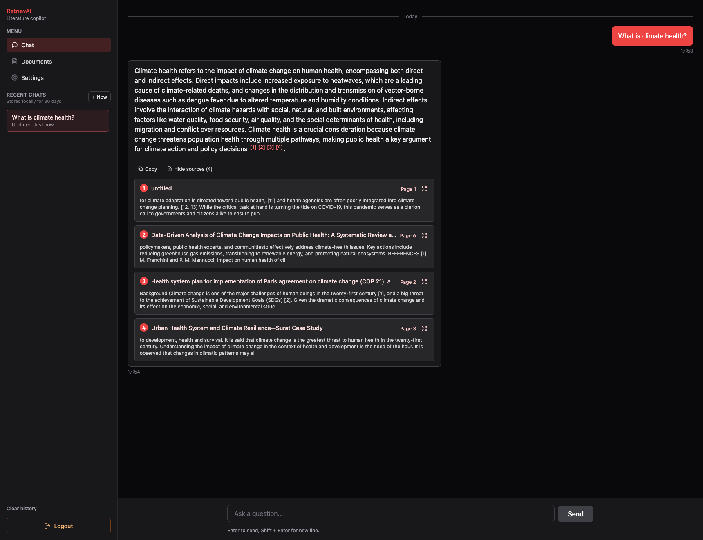
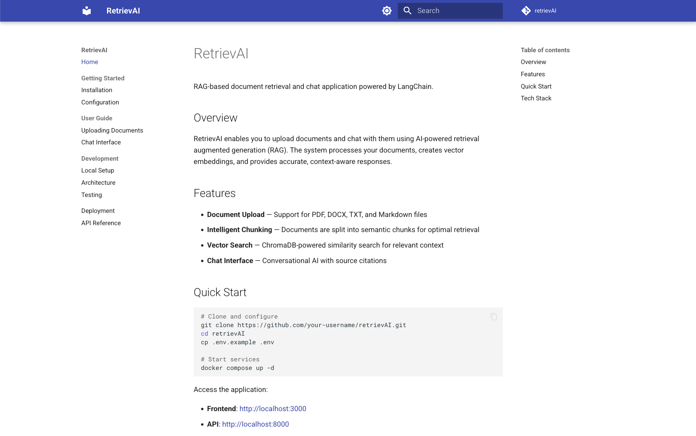

# RetrievAI

[](https://python.org)
[](https://fastapi.tiangolo.com)
[](https://react.dev)
[](https://postgresql.org)
[](https://trychroma.com)
[](https://docker.com)
[](LICENSE)

RAG-based document retrieval and chat application powered by LangChain.

<p align="center">
  
  
</p>

## Stack

- **Backend:** FastAPI, LangChain, PostgreSQL, ChromaDB
- **Frontend:** React, TypeScript, Vite
- **Infrastructure:** Docker Compose, Nginx, OpenStack

## Quick Start

```bash
cp .env.example .env
docker compose up -d
```

- Frontend: `http://localhost:3000`
- API: `http://localhost:8000`
- API Docs: `http://localhost:8000/api/docs`

## Documentation

📖 **[Full Documentation](https://jorgenosberg.github.io/retrievAI/)**

<p align="center">
  
</p>

- [Deployment Guide](docs/DEPLOYMENT.md)
- [Testing Guide](docs/TESTING.md)
