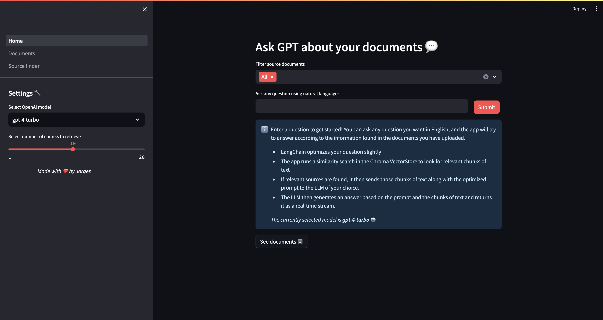

# 📑 RetrievAI

RetrievAI is a simple Streamlit application that uses Retrieval-Augmented-Generation (RAG) to speed up literature search and review processes. The app combines a local ChromaDB vector database and the OpenAI API to provide an efficient and effective way to search and review literature documents.

## 📸 Screenshots



## 📦 Packages used

- **Streamlit**: A web application framework that allows the creation of interactive and beautiful web apps quickly.
- **LangChain**: A framework for developing applications powered by language models.
- **ChromaDB**: A database designed to handle embedding-based retrieval tasks efficiently.
- **OpenAI API**: Provides access to OpenAI's language models for natural language understanding and generation.

## 🛠️ How to run the app

Follow these steps to set up and run the RetrievAI application on your local machine:

### 1. Clone or fork this GitHub repository

First, you need to clone or fork the repository to your local machine. (Or you can download the code as a ZIP file and extract it.)

```bash
git clone https://github.com/jorgenosberg/RetrievAI.git
cd RetrievAI
```

### 2. Install the required packages

Install the required packages from `requirements.txt`.

```bash
pip install -r requirements.txt
```

### 3. Modify settings in `.streamlit/secrets.toml`

Update the `.streamlit/secrets.toml` file with the necessary settings, including your OpenAI API key. The file should look something like this:

```toml
PERSIST_DIRECTORY="db"
CHUNK_SIZE=2000
CHUNK_OVERLAP=200
OPENAI_API_KEY="<YOUR_API_KEY>"
SOURCE_DIRECTORY="source_documents"
```

A `.streamlit/secrets.example.toml` file is also provided as a template.

### 4. Add source documents

Add your source documents to the `source_documents` folder. These documents will be included in the ingestion process when you run the ingestion script and will be a part of the document search later. The documents can be in any format, such as PDF, DOCX, or TXT files. The app will automatically extract the text from these documents and store them in ChromaDB for retrieval purposes. REMEMBER: These documents will be passed as context to the OpenAI API, so make sure to only include documents that you have the right to use.

### 5. Run ingestion script

Run the ingestion script to process and store the source documents in ChromaDB.

```bash
python ingest.py
```

### 6. Run the Streamlit app

Finally, run the Streamlit app.

```bash
streamlit run Home.py
```

Your app should now be running on `http://localhost:8501`, and you can interact with it through your web browser.

## 📁 Folder Structure

- `source_documents/`: Folder where you should place your source documents.
- `.streamlit/secrets.toml`: File to store sensitive information like API keys.
- `ingest.py`: Script to ingest and process source documents into ChromaDB.
- `Home.py`: Main script to run the Streamlit app.

## ℹ️ Additional Information

For more information on each package and how they are used within the app, refer to the following documentation:

- [Streamlit Documentation](https://docs.streamlit.io/)
- [LangChain Documentation](https://docs.langchain.com/)
- [ChromaDB Documentation](https://docs.trychroma.com/)
- [OpenAI API Documentation](https://platform.openai.com/docs/overview)

By following these steps, you should be able to set up and run the RetrievAI app, making literature search and review more efficient and effective. Enjoy using RetrievAI!
